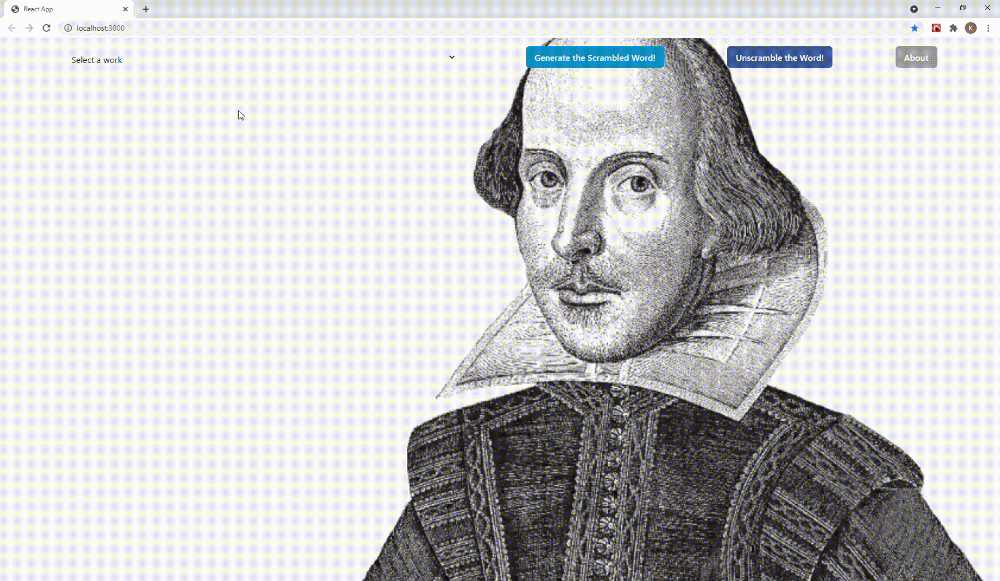

# Shakespeare Scrambler using BigQuery

- Note: YOU WILL NEED TO GENERATE AN API KEY FROM GOOGLE! https://cloud.google.com/docs/authentication/getting-started

## Description

A simple app which will query GCP's public BigQuery Shakespeare Dataset. It will scramble a word from the selected work and allow the user to guess what the word is

## Getting Started

### Dependencies

- Node
- GCP- BigQuery
- Express.js
- React
- Chakra-ui

### Installing

- Tested on Windows 10, dont know if it works on Linux/Mac
- You have to create a "Key.json" file with all your Google Application credentials. The .env file will then read it and use them to access the API
- For more info on generateing the Credentials (API KEYs): https://cloud.google.com/docs/authentication/getting-started

### Executing program

- npm i
- npm start

## Authors

    Konrad Kopko
    https://www.linkedin.com/in/konradkopko/
